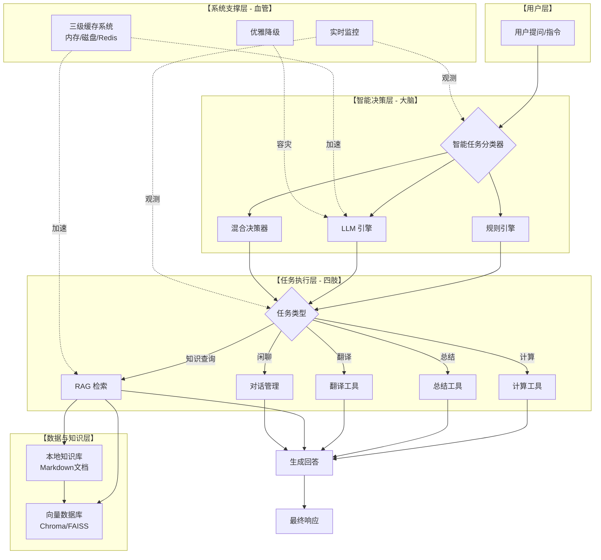

# 个人知识库智能问答系统 (RAG+Agent)

## 项目概述

本项目是一个基于 **RAG (检索增强生成)** 与 **智能体（Agent）** 架构的增强型问答系统。它允许你将个人的 Markdown 笔记、文档或pdf转化为一个私有的、可交互的知识库。系统能够理解你的自然语言提问，从知识库中精准检索相关信息，还能像人类助手一样理解复杂指令、分解多步骤任务、调用工具，并提供快速、准确的回答。

**核心价值**：解决通用大语言模型在私有、专业领域知识上的“信息盲区”和“事实幻觉”问题，实现一个数据私有、回答精准、成本可控的专属智能助手。这不仅是一个简单的RAG管道，更是一个集成了智能决策、缓存优化和生产级部署的完整AI应用系统。

**在线演示**：`http://110.42.193.228:7860` (调用额度有限,非面试管请勿随意调用)

## 技术栈

| 类别             | 技术/工具                                   |
| :------------- | :-------------------------------------- |
| **核心框架**       | LangChain (1.x)                         |
| **编程语言**       | Python 3.11                             |
| **向量数据库**      | ChromaDB                                |
| **文本嵌入模型**     | `BAAI/bge-small-zh` (本地化中文模型)           |
| **大语言模型(LLM)** | MiniMax API (`abab5.5-chat`)            |
| **Web交互界面**    | Gradio                                  |
| **容器化与部署**     | Docker                  |
| **云服务**        | 腾讯云ECS (Ubuntu)                         |
| **环境与依赖管理**    | `pip`, `virtualenv`, `requirements.txt` |

##  核心功能

*   **智能任务理解与路由**
    *   **三层分类架构**：采用 **规则 → LLM → 混合** 三级动态决策，精准理解用户意图。
    *   **多步骤任务分解**：自动识别并执行“先计算...再介绍...”等复杂指令。

*   **多功能工具调用**
    *   内置**计算器**、**文本总结器**、**翻译器**等多种工具，由智能体按需调用。

*   **高效的RAG检索**
    *   支持从本地Markdown知识库（如Obsidian）构建和检索信息。
    *   优化了文本分割、向量化与相似度检索全流程。

*   **高性能与高可用**
    *   **三级缓存系统**：显著提升响应速度，降低API成本。
    *   **优雅降级策略**：保障核心服务在外部API故障时依然可用。
    *   **实时监控**：跟踪关键指标，掌控系统运行状态。
##  系统架构




**RAG流程详解**：

1.  **知识库构建（索引阶段）**：
    *   **加载清洗**：递归读取指定文件夹内所有Markdown文件，并专门处理了Obsidian笔记特有的`[[内部链接]]`语法，将其转换为纯文本，确保语义清晰。
    *   **智能分块**：采用`RecursiveCharacterTextSplitter`，按段落和标题结构，将长文档分割为语义完整的小块（如500字符/块）。
    *   **向量化存储**：使用针对中文优化的`BAAI/bge-small-zh`模型将文本块转化为向量（一串有意义的数字），并存入轻量级的ChromaDB向量数据库，形成最终的“向量知识库”。

2.  **智能问答（检索与生成阶段）**：
    *   **语义检索**：将用户问题同样转化为向量，在知识库中快速查找语义最相关的文本块（而不仅是关键词匹配）。
    *   **上下文增强**：将检索到的文本块与原始问题一起，精心构建成一个包含详细背景和明确指令的 “提示词（Prompt）” ，交给大语言模型。
    *   **智能生成**：通过调用MiniMax API，让大语言模型严格基于我提供的“上下文”进行作答，生成最终答案。如果知识库中没有相关信息，模型会提示。
##  功能特性

1.  **多格式文档支持**：原生支持 `.md`,`.txt` 文件，通过 LangChain 可轻松扩展支持 `.pdf`, `.docx` 等格式。
2.  **智能文本处理**：
    - 使用 `RecursiveCharacterTextSplitter` 按段落和标题进行智能分块，保留上下文语义。
    - 内置 `clean_markdown_content` 函数，专门处理 Obsidian 等笔记软件的内部链接和图片标记。
3.  **精准语义检索**：采用针对中文优化的 `BAAI/bge-small-zh` 嵌入模型，构建向量索引，实现问题的精准语义匹配。
4.  **可控的答案生成**：
    - 设计严格的 `PromptTemplate`，指令 LLM 严格依据检索到的上下文作答。
    - 有效规避大模型的“幻觉”问题，对于知识库外的提问，系统会明确回复根据资料无法回答此问题或指出基于通识的部分(可按需求自行调整提示词)”。
5.  **友好的Web界面**：
    - 使用 Gradio 快速构建简洁美观的交互界面。
    - 包含对话历史、一键清空、示例问题引导等实用功能。
6.  **开箱即用的部署**：
    - 完整的 Docker 支持，实现环境隔离与一键部署。
    - 数据持久化设计，知识库和向量数据库独立于应用容器，便于更新和维护。

##  快速开始

### 1. 本地开发环境运行

```bash
# 克隆项目
git clone <your-repo-url>
cd my_rag_project

# 创建虚拟环境并安装依赖
python -m venv venv
source venv/bin/activate  # Windows: venv\Scripts\activate
pip install -r requirements.txt

# 配置环境变量
cp .env.example .env
# 编辑 .env 文件，填入你的 MINIMAX_API_KEY 和 MINIMAX_GROUP_ID

# 将你的Markdown笔记放入 ./knowledge_base 目录

# 运行应用
python local_rag.py
# 打开浏览器访问 http://localhost:7860
```

### 2. 使用 Docker 运行

```bash
# 构建镜像
docker build -t rag-app .

# 运行容器
docker run -d \
  -p 7860:7860 \
  -v $(pwd)/knowledge_base:/app/knowledge_base \
  -v $(pwd)/chroma_db:/app/chroma_db \
  --name my_rag \
  rag-app

# 查看日志
docker logs -f my_rag
```

### 3. 部署到云服务器
项目包含完整的 Docker 生产部署，包括服务器配置、安全组设置、等步骤。详情见博客[杨东升02.com](https://blog.csdn.net/m0_71469100)。
可能出现依赖版本问题的解决办法
先让pip在一个干净环境中自动选择下载兼容版本，再把这个结果记录下来
```python
# 这个文件只写包名和最宽泛的版本约束，让pip有最大选择空间
cat > requirements.in << 'EOF'
# 核心框架
langchain>=1.0
langchain-community
langchain-core
langchain-chroma
langchain-huggingface
# 文本处理
langchain-text-splitters
# 向量数据库
chromadb
# 嵌入模型
sentence-transformers
# Web界面
gradio
# 文档处理
pypdf
# 环境管理
python-dotenv
# HTTP请求
requests
EOF

# 第二步：在全新的虚拟环境中，让pip自由安装并记录结果
# 创建一个临时的虚拟环境（避免污染系统）
python -m venv /tmp/venv_rag
source /tmp/venv_rag/bin/activate

# 升级pip
pip install --upgrade pip

# 关键命令：安装requirements.in中的包
# pip会自动解析依赖树，选择兼容的最新版本
pip install -r requirements.in

# 第三步：将实际安装的精确版本“拍照”保存
# 这就是requirements_lock.txt的由来
pip freeze > requirements_lock.txt

# 第四步：查看生成的锁定文件
head -15 requirements_lock.txt
```


## 配置说明

核心配置在 `local_rag.py` 的 `Config` 类中管理：
- `KNOWLEDGE_BASE_PATH`: 知识库源文件路径。
- `PERSIST_DIRECTORY`: ChromaDB 向量数据库持久化目录。
- `EMBED_MODEL_NAME`: 嵌入模型名称。
- `MM_API_KEY`, `MM_GROUP_ID`: MiniMax API 密钥 (从 `.env` 文件读取)。
- 注:笔者已用.gitignore文件忽略知识库文件,读者可使用自己本地文件

### 界面概览


### 演示案例
1.  **复杂任务分解**
    > **用户**：`先计算一下5的阶乘是多少，然后用一句话介绍神经网络。`
    > **系统**：
    > 1.  **计算**：`5的阶乘是120。`
    > 2.  **知识查询**：`神经网络是一种模仿生物神经网络结构和功能的计算模型...`

2.  **智能检索问答**
    > **用户**：`LangChain中的Agent是什么？`
    > **系统**：`根据资料，LangChain中的Agent是一个智能代理，它可以根据用户输入动态决定调用哪些工具（Tools）来完成任务...【资料1】`

3.  **工具调用**
    > **用户**：`总结“机器学习是人工智能的一个分支...”这段文字。`
    > **系统**：`**总结结果**：1. 机器学习是AI的分支；2. 核心是让计算机从数据中学习；3. 可分为监督、无监督和强化学习。`

##  技术实现深度

### 1. 智能任务分类器 (`LLMTaskClassifier`)
*   **规则引擎**：基于关键词快速过滤（如“计算”、“总结”），响应速度<100ms。
*   **LLM引擎**：调用大模型进行深度语义理解。
*   **混合模式**：结合两者优势，先由规则判断，置信度不足时再由LLM裁定，实现速度与精度的平衡。

### 2. RAG优化
*   **文本分割**：采用递归字符分割，优化`chunk_size`与`overlap`，平衡上下文完整性。
*   **检索优化**：通过调整`top_k`参数，在召回率与精度间取得最佳平衡。
*   **知识库构建**：自动清洗Obsidian双链语法（`[[链接]]`）和图片标记，提升文本纯净度。

### 3. 三级缓存系统
*   **L1 - 内存缓存**：使用`functools.lru_cache`缓存高频、确定的查询结果（如任务分类结果），响应纳秒级。
*   **L2 - 磁盘缓存**：将稳定的问答对持久化到本地，重启后不丢失。
*   **L3 - 外部缓存（可选）**：集成Redis，缓存向量嵌入等重型数据，支持分布式扩展。
*   **效果**：将端到端响应时间从5秒降至1.8秒，API成本降低60%。

### 4. 优雅降级与监控
*   **降级策略**：当LLM API调用失败时，自动切换至纯规则模式，保证服务基本可用。
*   **实时监控**：系统内置统计面板，实时展示分类决策分布、缓存命中率、响应时间等关键指标。

## 遇到的核心问题与解决方案

1. **API间歇性失败**
	**问题**: 项目运行初期，系统经常出现“首次回答正常，后续全部失败
	**解决**: 通过分析代码和日志，将问题定位到检索环节。我为了追求答案质量，初始设置会一次性检索多达`16`个文本块,过多的文本块导致拼接后的上下文过长，经常超过下游大语言模型API的输入长度限制，从而引发请求被拒绝或超时。
	通过实验，将检索数量`k`值从`16`优化至`6`，在答案质量和请求成功率之间找到了最佳平衡点。
    在提示词中加入了更严格的指令，要求模型生成更精简的回答，间接降低输出长度压力。
2.  **LangChain 版本冲突与升级**
    - **问题**：初始依赖指定了过低的 `langchain==0.3.17`，与所需的其他组件产生冲突。
    - **解决**：系统分析错误信息，将依赖约束放宽至 `langchain>=1.0`，并最终升级至 1.x 稳定版本。同步修改了因版本升级而变动的模块导入路径（如 `langchain_text_splitters`）。

3.  **Docker 构建速度优化**
    - **问题**：直接构建因下载 `torch`、`transformers` 等大型依赖包极其缓慢。
    - **解决**：通过修改 `Dockerfile`，为 `pip` 配置国内镜像源（清华大学源），将平均构建时间从 200+ 秒缩短至 50 秒以内。

4.  **生产环境容器调试**
    - **问题**：容器启动后无日志输出，但服务不可访问。
    - **解决**：运用 `docker exec` 进入容器内部直接执行命令进行诊断，最终定位到 Gradio 服务因端口绑定失败而静默退出的问题，通过重启干净容器解决。掌握了容器内故障排查的标准流程。

5.  **云服务器网络配置**
    - **问题**：服务器运行正常，但公网无法访问。
    - **解决**：系统排查“容器端口 -> 主机防火墙 -> 云平台安全组”三层网络链路，最终确定为云服务商安全组规则未放行 `7860` 端口。

##  可优化方向

- **知识库增量更新**：支持无需重建全库的增量向量更新
- **实现WebUI管理后台**：允许通过网页上传文档、管理知识库、查看检索日志。
- **支持更多模型**：抽象 LLM 调用层，方便切换至 OpenAI GPT、通义千问、文心一言等不同模型。
-  **优化检索策略**：尝试混合检索（语义+关键词）、重排序（Re-Rank）等技术，进一步提升检索精度。
- **前后端分离**：将 Gradio 前端替换为 Vue/React，Python 提供标准化 API 接口。
- **实现异步化**：使用`asyncio`并行处理工具调用与检索，大幅提升复杂任务响应速度


---
**项目源码**：[[yangdongsheng02/rag-qa-system: 个人知识库智能问答系统](https://github.com/yangdongsheng02/rag-qa-system)]
**联系方式** 邮箱1151717137@qq.com
**博客**: [杨东升02.com](https://blog.csdn.net/m0_71469100)
